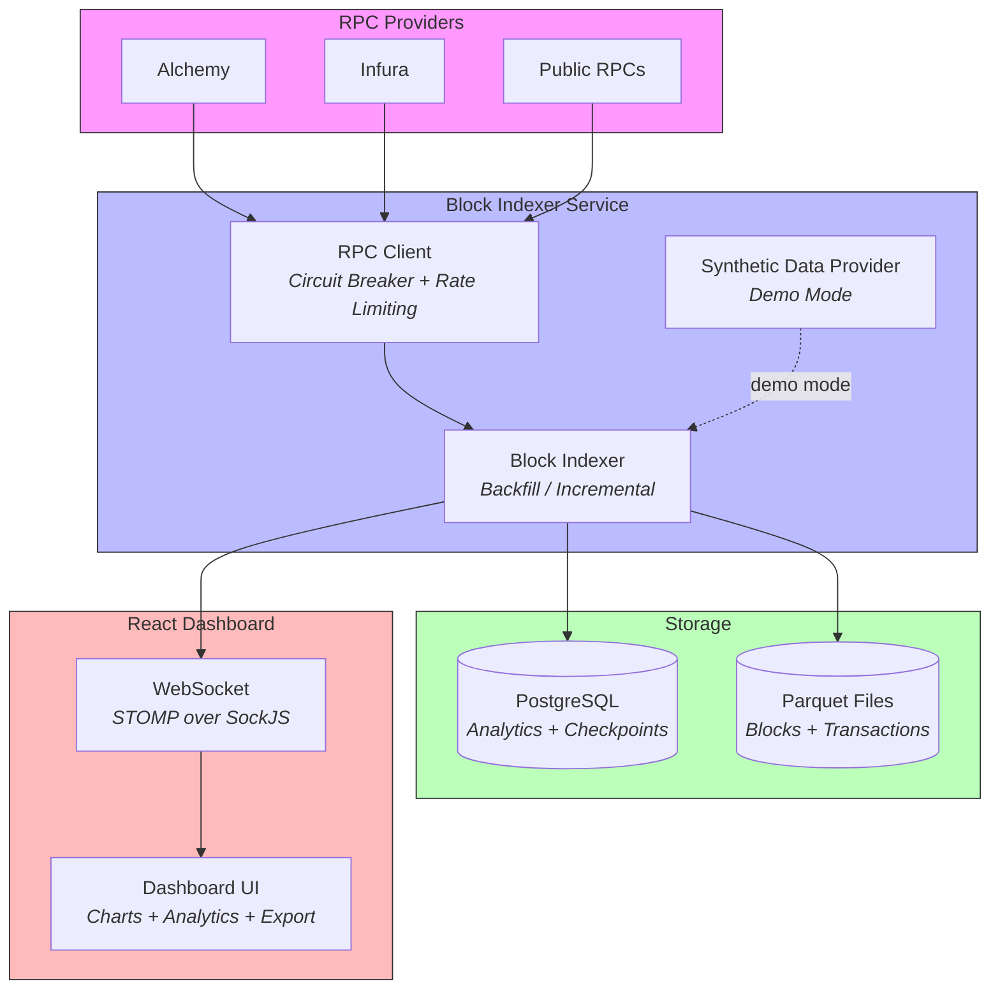

<p align="center">
  
</p>

<h1 align="center">Multi-Chain Block Indexer</h1>

<p align="center">
  A full-stack blockchain indexer that fetches blocks from multiple EVM chains via JSON-RPC, processes them concurrently, persists analytics to PostgreSQL, exports to Apache Parquet, and streams real-time updates to an interactive React dashboard.
</p>

<p align="center">
  <a href="https://github.com/peterstringer/blockchain-indexer/actions/workflows/ci.yml"></a>
  <a href="https://github.com/peterstringer/blockchain-indexer/actions/workflows/codeql.yml"></a>
  <a href="https://github.com/peterstringer/blockchain-indexer/releases"></a>
  <a href="https://github.com/peterstringer/blockchain-indexer/pkgs/container/blockchain-indexer"></a>
  
  
  
</p>

---

## Overview

The Multi-Chain Block Indexer connects to EVM-compatible blockchains via JSON-RPC, fetches blocks and transactions concurrently, persists block analytics to PostgreSQL, writes raw data to Apache Parquet files, and streams real-time updates to a React dashboard over WebSocket.

### Key Features

- **Multi-chain indexing** — Ethereum, Polygon, and Arbitrum with independent indexing loops
- **Two indexing modes** — Backfill (historical ranges) and Incremental (live tail with reorg detection)
- **Circuit breaker + rate limiting** — Per-provider health tracking with automatic failover
- **Block analytics** — Per-block metrics persisted to PostgreSQL with 12 historical query endpoints
- **Interactive dashboard** — React 19 with live throughput, gas analytics, heatmaps, and RPC health
- **Data export** — Customizable CSV/Parquet export with column selection and streaming download
- **Apache Parquet** — Columnar storage with SNAPPY compression and chain/date partitioning
- **Crash-safe checkpoints** — Atomic checkpoint updates in PostgreSQL for resume-on-restart
- **Demo mode** — Deterministic synthetic data generation without RPC or database dependencies
- **Prometheus metrics** — Micrometer integration with `/actuator/prometheus` endpoint

---

## Why This Project

This project demonstrates the kind of data infrastructure work done at companies like **Dune Analytics** — ingesting, transforming, and storing blockchain data at scale for analytical queries.


### Technologies

**Backend:** Java 25, Spring Boot 4.0.2, Web3j, Apache Parquet, Apache Avro, Hadoop, PostgreSQL, Flyway, Lombok

**Frontend:** React 19, TypeScript 5.9, Vite 7, Tailwind CSS v4, TanStack React Query v5, Recharts 3.7, STOMP/SockJS

**Infrastructure:** Docker, GitHub Actions, Testcontainers, Prometheus/Micrometer

---

## Architecture



### Component Overview

| Component | Responsibility |
|-----------|---------------|
| **BlockIndexerService** | Orchestrates chain lifecycle, manages backfill/incremental loops, coordinates concurrency |
| **RpcClientService** | Web3j client management, circuit breaker state machine, token-bucket rate limiting, provider failover |
| **BlockAnalyticsService** | Converts indexed blocks to analytics summaries, persists to PostgreSQL (non-blocking) |
| **ParquetWriterService** | Buffers records in memory, flushes to timestamped Parquet files with configurable partitioning |
| **WebSocketService** | Broadcasts progress, block notifications, and RPC health with per-topic throttling |
| **ExportService** | Streams block analytics data as CSV or Parquet with column selection |
| **SyntheticDataProvider** | Generates deterministic, realistic block/transaction data for demo mode |

### Concurrency Model

Two thread pools prevent deadlocks between chain loops and block fetching:

```
chainExecutor (cached, unbounded)          fetchExecutor (fixed, 10 threads)
├── ethereum-loop ─── batch ──────────────► fetch block 100 ┐
├── polygon-loop  ─── batch ──────────────► fetch block 101 ├── parallel
└── arbitrum-loop ─── batch ──────────────► fetch block 102 ┘
```

### Circuit Breaker

```
CLOSED ──(5 consecutive failures)──► OPEN
  ▲                                    │
  │                               (30s timeout)
  │                                    ▼
  └──────(success)──────── HALF_OPEN ◄─┘
```

Each RPC provider is tracked independently. When all providers for a chain are OPEN, the least-recently-failed provider is promoted to HALF_OPEN for a probe request.

---

## Features

### Multi-Chain Support

Each chain runs an independent indexing loop with its own:
- RPC provider pool with failover
- Rate limiter (configurable requests/second)
- Checkpoint for crash recovery
- Parquet output partitions

Currently supported: **Ethereum** (chain ID 1), **Polygon** (chain ID 137), **Arbitrum** (chain ID 42161).

### Indexing Modes

**Backfill** — Index a historical block range:
- Processes blocks in configurable batch sizes (default 50)
- Concurrent fetching within each batch
- Displays ETA based on throughput
- Supports reverse backfill (indexing backward toward genesis)

**Incremental** — Live tail with reorg detection:
- Polls for new blocks every 5 seconds
- Compares `parentHash` to detect chain reorganizations
- On reorg: rolls back checkpoint and re-indexes from fork point

Both modes can run simultaneously for the same chain.

### Block Analytics

Per-block metrics are persisted to PostgreSQL with 23 columns covering gas pricing, block fullness, transaction type breakdowns, and timing data. The analytics table powers 12 historical query endpoints and the data export feature.

### Parquet Export

Blocks and transactions are written to separate Parquet files with:
- **SNAPPY compression** for fast read/write
- **Chain partitioning** (`output/ethereum/`, `output/polygon/`)
- **Date partitioning** (`output/ethereum/2026-02-20/`)
- **128 MB row groups** and **1 MB page sizes**
- **In-memory buffering** with automatic flush at 1000 records

### Real-Time Dashboard

The React dashboard provides four tabs:

**Dashboard** — Live indexing status:
- Overview bar with aggregate statistics and global controls
- Chain cards with per-chain status, throughput, lag, and start/stop/sync/backfill controls
- Coverage bar showing indexed range with glow animation on new blocks
- Collapsible system details with live block feed and RPC health panel

**Analytics** — Historical analysis (from PostgreSQL):
- Date range picker with presets (7D, 30D, 90D, All) and chain filter
- Gas Market chart (base fee + effective gas price trends)
- Block Space Demand chart (block fullness vs base fee correlation)
- Transaction Type Evolution (EIP-1559 vs legacy vs contract, stacked area)
- Failure Analysis chart (failed tx rate vs gas price, dual Y-axis)
- Transaction Density Heatmap (hour x day-of-week interactive heatmap)

**Export** — Customizable data export:
- Three-step wizard: select date range → choose columns (19 available) → download (CSV or Parquet)
- Streaming download for large datasets
- Column selection grouped by category (Block Info, Gas Pricing, Block Fullness, Transaction Counts, Gas per Type)

**Settings** — Configuration and monitoring:
- Chain configuration with editable start blocks
- Checkpoint table showing indexing progress per chain
- System health indicators

### Demo Mode

Run the full application without RPC providers or PostgreSQL:
- Generates deterministic synthetic data (same seed = same output)
- Realistic gas economics with daily cycles and congestion spikes
- Configurable block count and random seed
- Uses H2 in-memory database

---

## Quick Start

### Docker (recommended)

```bash
git clone https://github.com/peterstringer/blockchain-indexer.git
cd blockchain-indexer

# Configure API keys
cp .env.example .env
# Edit .env with your Alchemy/Infura keys

# Start the full stack
docker compose up -d

# Open the dashboard
open http://localhost:8080
```

### Demo Mode (no API keys needed)

```bash
docker compose -f docker-compose.yml -f docker-compose.demo.yml up -d
```

### Local Development

```bash
# Start PostgreSQL only
docker compose -f docker-compose.yml -f docker-compose.dev.yml up -d postgres

# Build and run the frontend
cd frontend && npm ci && npm run build && cd ..

# Start the application
mvn spring-boot:run
```

### Prerequisites

- **Java 25** (Eclipse Temurin recommended)
- **Node.js 20** (for frontend build)
- **Docker** (for PostgreSQL and containerized deployment)
- **Maven 3.9+**

---

## Configuration

### Environment Variables

| Variable | Description | Default |
|----------|-------------|---------|
| `ALCHEMY_ETH_URL` | Alchemy Ethereum RPC | `https://eth.llamarpc.com` |
| `ALCHEMY_POLYGON_URL` | Alchemy Polygon RPC | `https://polygon.llamarpc.com` |
| `ALCHEMY_ARBITRUM_URL` | Alchemy Arbitrum RPC | `https://arb1.arbitrum.io/rpc` |
| `INFURA_ETH_URL` | Infura Ethereum RPC | `https://ethereum-rpc.publicnode.com` |
| `INFURA_POLYGON_URL` | Infura Polygon RPC | `https://polygon-bor-rpc.publicnode.com` |
| `INFURA_ARBITRUM_URL` | Infura Arbitrum RPC | `https://arbitrum-one-rpc.publicnode.com` |
| `DATABASE_URL` | PostgreSQL JDBC URL | `jdbc:postgresql://localhost:5432/indexer` |
| `DATABASE_USERNAME` | Database user | `postgres` |
| `DATABASE_PASSWORD` | Database password | `postgres` |
| `PARQUET_OUTPUT_PATH` | Output directory for Parquet files | `./output` |
| `DEMO_MODE` | Enable synthetic data mode | `false` |

### Chain Configuration

Each chain is configured in `application.yml` under `indexer.chains`:

```yaml
indexer:
  chains:
    ethereum:
      name: Ethereum
      chain-id: 1
      rpc-urls:
        - ${ALCHEMY_ETH_URL}
        - ${INFURA_ETH_URL}
      start-block: 21000000       # First block to index
      end-block:                  # null = no limit (for incremental)
      max-retries-per-block: 3    # Exponential backoff retries
      retry-delay-ms: 1000       # Initial retry delay
      rate-limit-requests-per-second: 10
```

### Concurrency Tuning

```yaml
indexer:
  concurrency:
    worker-threads: 10    # Parallel block fetch threads
    batch-size: 50        # Blocks per batch in backfill mode
    max-queue-size: 500   # Internal queue depth
```

### Parquet Output

```yaml
indexer:
  parquet:
    output-path: ./output
    compression-codec: SNAPPY     # SNAPPY, GZIP, UNCOMPRESSED
    partition-by-chain: true      # output/ethereum/, output/polygon/
    partition-by-date: true       # output/ethereum/2026-02-20/
    row-group-size: 134217728     # 128 MB
    page-size: 1048576            # 1 MB
```

---

## API Documentation

Interactive API docs are available at **http://localhost:8080/swagger-ui.html** when the application is running.

### Indexer Control

```bash
# Start backfill indexing for Ethereum
curl -X POST http://localhost:8080/api/indexer/start \
  -H 'Content-Type: application/json' \
  -d '{"chain": "ethereum", "mode": "BACKFILL"}'

# Start incremental (live tail) for Polygon
curl -X POST http://localhost:8080/api/indexer/start \
  -H 'Content-Type: application/json' \
  -d '{"chain": "polygon", "mode": "INCREMENTAL"}'

# Stop a specific chain
curl -X POST http://localhost:8080/api/indexer/stop \
  -H 'Content-Type: application/json' \
  -d '{"chain": "ethereum"}'

# Stop all chains
curl -X POST http://localhost:8080/api/indexer/stop \
  -H 'Content-Type: application/json' -d '{}'
```

### Status & Health

```bash
# Overall status
curl http://localhost:8080/api/indexer/status

# Single chain status
curl http://localhost:8080/api/indexer/status/ethereum

# Health check (for container orchestrators)
curl http://localhost:8080/api/indexer/health

# Operational metrics
curl http://localhost:8080/api/indexer/metrics

# Chain configuration
curl http://localhost:8080/api/indexer/config
```

### Checkpoints

```bash
# List all checkpoints
curl http://localhost:8080/api/indexer/checkpoints

# Reset checkpoint (requires confirmation)
curl -X POST 'http://localhost:8080/api/indexer/checkpoints/ethereum/reset?confirm=true'
```

### Analytics

```bash
# Gas price aggregation for a block range (max 1000 blocks)
curl 'http://localhost:8080/api/analytics/gas-prices?chain=ethereum&fromBlock=21000000&toBlock=21000100'

# Block lookup
curl http://localhost:8080/api/analytics/blocks/ethereum/21000000

# Transaction search (across all chains)
curl http://localhost:8080/api/analytics/transactions/0xabc123...
```

### Historical Analytics

All endpoints accept `from` and `to` (ISO dates) and optional `chain` filter.

```bash
# Daily gas market trends
curl 'http://localhost:8080/api/analytics/historical/gas-market?from=2026-01-01&to=2026-02-25'

# Block fullness over time
curl 'http://localhost:8080/api/analytics/historical/block-fullness/daily?chain=ethereum&from=2026-01-01'

# Transaction type breakdown
curl 'http://localhost:8080/api/analytics/historical/transaction-types/daily?from=2026-02-01'

# Failed transaction rate
curl 'http://localhost:8080/api/analytics/historical/failure-rate?chain=ethereum&from=2026-01-01'

# Transaction density heatmap (hour x day-of-week)
curl 'http://localhost:8080/api/analytics/historical/tx-density-heatmap?from=2026-01-01'

# Cross-chain comparison
curl 'http://localhost:8080/api/analytics/historical/cross-chain-normalised?from=2026-01-01'

# Data availability per chain
curl http://localhost:8080/api/analytics/historical/data-availability
```

### Data Export

```bash
# Get export metadata (available columns, chains, date ranges)
curl http://localhost:8080/api/export/metadata

# Export as CSV with selected columns
curl -o analytics.csv 'http://localhost:8080/api/export/block-analytics?format=csv&chain=ethereum&from=2026-01-01&to=2026-02-25&columns=chain,block_number,base_fee,avg_gas_price,transaction_count'

# Export as Parquet
curl -o analytics.parquet 'http://localhost:8080/api/export/block-analytics?format=parquet&chain=ethereum&from=2026-01-01'
```

---

## Querying Parquet Data

The Parquet files are compatible with any columnar query engine.

### DuckDB

```sql
-- Install and load
INSTALL parquet;
LOAD parquet;

-- Query blocks
SELECT chain, block_number, transaction_count, base_fee_per_gas / 1e9 AS base_fee_gwei
FROM read_parquet('output/ethereum/2026-02-20/blocks_*.parquet')
ORDER BY block_number DESC
LIMIT 20;

-- Gas analytics across chains
SELECT chain,
       COUNT(*) AS blocks,
       AVG(gas_used_percentage) AS avg_utilization,
       AVG(base_fee_per_gas / 1e9) AS avg_base_fee_gwei
FROM read_parquet('output/*/blocks_*.parquet')
GROUP BY chain;

-- Large transactions
SELECT chain, tx_hash, from_address, to_address, value / 1e18 AS eth_value
FROM read_parquet('output/ethereum/*/transactions_*.parquet')
WHERE value > 10e18
ORDER BY value DESC
LIMIT 10;
```

### Python / pandas

```python
import pandas as pd

# Read all Ethereum blocks
df = pd.read_parquet("output/ethereum/", engine="pyarrow")

# Gas utilization over time
df["base_fee_gwei"] = df["base_fee_per_gas"] / 1e9
print(df[["block_number", "transaction_count", "gas_used_percentage", "base_fee_gwei"]].describe())
```

---

## Development

### Running Tests

```bash
# Unit tests only (131 tests)
mvn test

# Unit + integration tests (requires Docker for Testcontainers)
mvn verify
```

### Project Structure

```
blockchain-indexer/
├── src/main/java/com/peterstringer/blockchain/indexer/
│   ├── config/          # Spring configuration and properties binding
│   ├── controller/      # REST API (Indexer, Analytics, Historical, Export, ExceptionHandler)
│   ├── dto/             # Request/response data transfer objects
│   ├── exception/       # Custom exceptions (ChainNotFound, AlreadyRunning, NotRunning)
│   ├── model/           # Domain objects (IndexedBlock, IndexedTransaction, BlockAnalytics)
│   │   └── ws/          # WebSocket message types (Progress, Block, RpcHealth)
│   ├── repository/      # JPA repositories (Analytics, Checkpoint, Metrics, RpcHealth)
│   └── service/         # Core services (BlockIndexer, RpcClient, ParquetWriter,
│                        #   BlockAnalytics, WebSocket, SyntheticData, Export)
├── src/main/resources/
│   ├── db/migration/    # Flyway SQL migrations (V1–V6)
│   ├── application.yml  # Main configuration
│   ├── application-demo.yml   # Demo profile (H2 database)
│   └── application-local.yml  # Local development profile
├── src/test/
│   └── java/.../        # Unit tests (*Test.java) and integration tests (*IT.java)
├── frontend/            # React/TypeScript dashboard
│   ├── src/
│   │   ├── pages/       # Page containers (Dashboard, Analytics, Export, Settings)
│   │   ├── components/  # UI components (charts, cards, panels, common)
│   │   ├── hooks/       # Custom React hooks (WebSocket, API, analytics)
│   │   ├── services/    # API client and WebSocket service
│   │   ├── types/       # TypeScript interfaces
│   │   └── utils/       # Formatting utilities
│   └── vite.config.ts
├── docker/              # Docker entrypoint script
├── Dockerfile           # Multi-stage build (Node + Maven + JRE)
├── docker-compose.yml       # Production stack
├── docker-compose.dev.yml   # Dev override (PostgreSQL only)
└── docker-compose.demo.yml  # Demo mode override
```

### Database Schema

Managed by Flyway with 6 migrations:

| Table | Migration | Purpose |
|-------|-----------|---------|
| `indexer_checkpoints` | V1, V6 | Last indexed block per chain + backfill floor for crash recovery |
| `indexer_metrics` | V2 | Time-series operational metrics (blocks/sec, error rates) |
| `rpc_provider_health` | V3 | Circuit breaker state per RPC provider |
| `block_analytics` | V4, V5 | Per-block analytics with 23 columns (gas, transactions, timing) |

---

## Performance

Throughput depends on RPC provider latency and rate limits.

| Configuration | Throughput |
|---------------|-----------|
| Alchemy free tier, 10 threads, batch 50 | ~40-60 blocks/sec (Ethereum) |
| Public RPCs, 4 threads, batch 10 | ~10-20 blocks/sec |
| Demo mode (synthetic data) | ~500+ blocks/sec |

### Optimization Tips

- Increase `worker-threads` if your RPC provider allows higher rate limits
- Use Alchemy or Infura paid tiers for higher throughput
- Set `partition-by-date: true` for better query pruning in DuckDB/Spark
- Use SNAPPY compression (default) for the best read/write balance

---

## Troubleshooting

| Issue | Solution |
|-------|---------|
| `Connection to localhost:5432 refused` | Start PostgreSQL: `docker compose up -d postgres` |
| `Rate limit exceeded` on RPC | Reduce `rate-limit-requests-per-second` in config |
| All RPC providers showing OPEN | Check API keys in `.env`; providers auto-recover after 30s |
| Parquet write errors on JDK 25 | Known Hadoop compatibility issue; buffering continues, files written on flush |
| `Port 8080 already in use` | Stop other services or change `server.port` in `application.yml` |
| Integration tests failing | Ensure Docker is running (required for Testcontainers) |
| Frontend not loading | Build frontend first: `cd frontend && npm ci && npm run build` |

---

## CI/CD

GitHub Actions workflows:

| Workflow | Trigger | What It Does |
|----------|---------|-------------|
| **CI** | Push to main, PRs | Build, unit tests, integration tests, frontend build, Docker image |
| **Release** | `v*` tags | JAR artifact, GitHub Release, versioned Docker image to ghcr.io |
| **CodeQL** | Push to main, weekly | Security vulnerability scanning for Java |
| **Dependabot** | Weekly | Dependency update PRs for Maven, npm, Actions, Docker |

---

## License

This project is licensed under the [PolyForm Noncommercial License 1.0.0](LICENSE).

Copyright &copy; 2026 Peter Stringer

You may use this software for non-commercial purposes including research, personal study, hobby projects, and educational use.

---

## Acknowledgments

- [Web3j](https://github.com/web3j/web3j) — Java library for Ethereum JSON-RPC
- [Apache Parquet](https://parquet.apache.org/) — Columnar storage format
- [Spring Boot](https://spring.io/projects/spring-boot) — Application framework
- [Recharts](https://recharts.org/) — React charting library
- [TanStack Query](https://tanstack.com/query) — Server state management for React
- [Testcontainers](https://testcontainers.com/) — Docker-based integration testing

---

<p align="center">
  Built by <a href="https://github.com/peterstringer">Peter Stringer</a>
</p>
